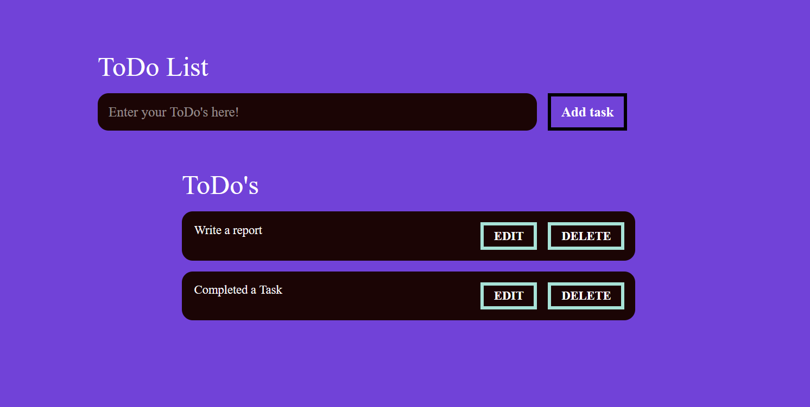

<h1>Todo-List ( <a href="https://chetand1.netlify.app/">Live Link )</a></h1>
<h2>About</h2>

This Todo List website is created using only HTML CSS JS.

<h2>What did I learn by making this project?
</h2>
1. learn about How backend is work.  
2. learn about javascript .
<h3>Time taken to finish this project?</h3>

30 Min

<h2>Output :- </h2>

