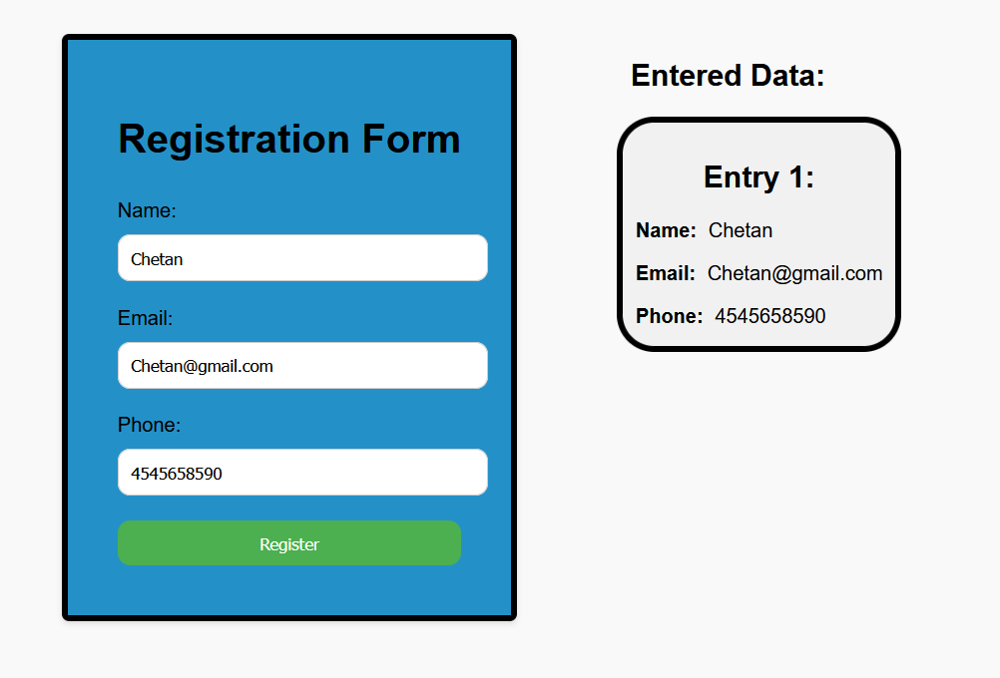

<h1> Registration Form ( <a href="https://csd1.netlify.app/">Live Link )</a></h1>
<h2>About</h2>

This Registration Form website is created using only HTML CSS JS.
 

<h2>What did I learn by making this project?
</h2>
1. learn about How backend is work.  
2. learn about javascript.

<h3>Time taken to finish this project?</h3>

1 Hour

<h2>Output :- </h2>

